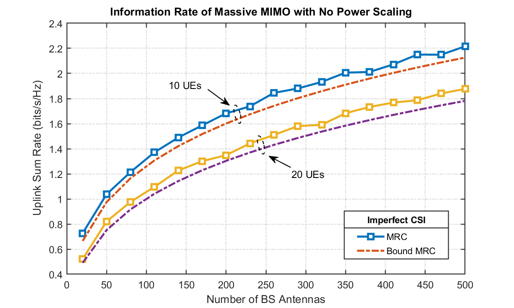

# Information-Rate-of-mmWave-Massive-MIMO-System
## Perfect CSI 

- Problem Statements: Simulate a mmWave Massive MIMO wireless system in MATLAB for perfect CSI assumtion for K = 10 Single antenna users. Generate uplink sum rate for both MRC and ZF receivers and show how no of antennas at BS impacts information rate in Infomation vs No of antennas curve. 

- Simulation:


Large scale fading co-efficient for user $k$ is defined as - 


$$\beta_k = \frac{||\bar{h}_k||^2}{N_r}$$


Where $N_r$ is total no. of BS antennas. So, as the number of BS antennas $N_r$ is large or tends to be $\infty$, the channel is behaving as less and less fluctuating, or, we can say, less and less fading, called Channel Hardenning.


So for given user $k$-


```math
SINR = \frac{||\bar{h}_{k}||^2P_k}{{\sum_{i\neq k} p_i \beta_i}+N_o}
```


Now if we decrease power as (Power Scaling Law)-


$$P_k = \frac{E_k}{N_r}$$


and if $N_r\rightarrow\infty$ then-


$$SINR=\frac{\beta_k E_k}{N_o}$$


As $N_r$ is becoming large, transmit power of each user is becoming zero and $SINR$ is becoming constant. 


## Imperfect CSI:

- Problem Statement:

- Simulation: 





- Problem Statement:

- Simulation: 


- Problem Statement:

- Simulation: 


