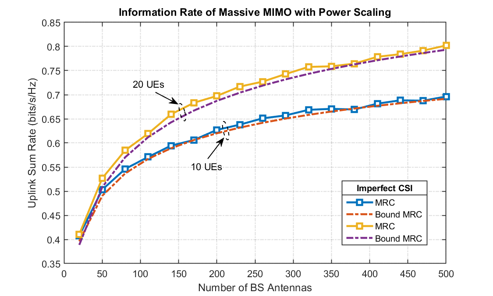

# Information-Rate-of-mmWave-Massive-MIMO-System
## Perfect CSI 

- Problem Statement:

- Simulation:

- Problem Statement:

- Simulation:

## Imperfect CSI:

- Problem Statement:

- Simulation: 

- Problem Statement:

- Simulation: 

- Problem Statement:

- Simulation: 

