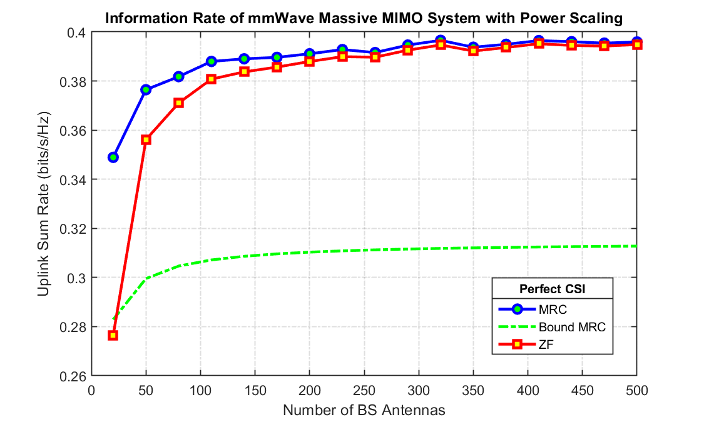
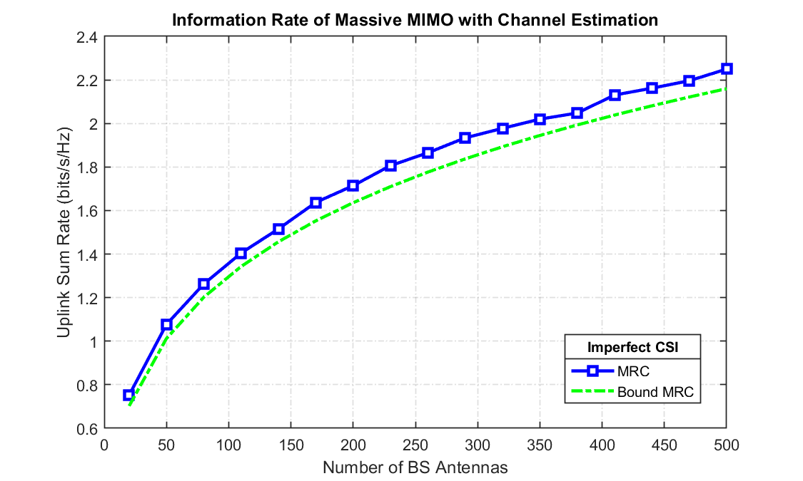

# Information-Rate-of-mmWave-Massive-MIMO-System
## Perfect CSI 

### Model of mmWave Massive-MIMO System:


```math
    \bar{y} = \textbf{H}\bar{x} + \bar{\eta} 
```


```math
    \bar{y} = \bar{h}_k x_k + {\sum_{j \neq k}\bar{h}_j x_j} + \bar{\eta} 
```


```math
    \bar{y} = \textbf{H}\bar{x} + \bar{\eta} 
```

We combine signals from all BS antennas using MRC ($\bar{w}$) receiver.


```math
    \bar{w} = \frac{\bar{h}_k}{||\bar{h}_k||}
```


```math
    \hat{x}_k = \bar{w}^{H}\bar{y}
```


```math
    \hat{x}_k = \frac{\bar{h}^{H}_k}{||\bar{h}_k||}(\bar{h}_k x_k + {\sum_{j \neq k}\bar{h}_j x_j} + \bar{\eta})
```


- Problem Statements: Simulate a mmWave Massive MIMO wireless system in MATLAB for perfect CSI assumtion for K = 10 Single antenna users. Generate uplink sum rate for both MRC and ZF receivers and show how no of antennas at BS impacts information rate in Infomation Rate vs Number of BS Antennas curve. 

- Simulation:


Large scale fading co-efficient for user $k$ is defined as - 


$$\beta_k = \frac{||\bar{h}_k||^2}{N_r}$$


Where $N_r$ is total no. of BS antennas and $\bar{h}_k$ is channel corresponding to user $k$. So, as the number of BS antennas $N_r$ is large or tends to be $\infty$, the channel is behaving as less and less fluctuating, or, we can say, less and less fading, called Channel Hardenning.


So for given user $k$-


```math
SINR = \frac{||\bar{h}_{k}||^2P_k}{{\sum_{i\neq k} p_i \beta_i}+N_o}
```


Now if we decrease power of user $k$ as (Power Scaling Law)-


$$P_k = \frac{E_k}{N_r}$$


and if $N_r\rightarrow\infty$ then-


$$SINR=\frac{\beta_k E_k}{N_o}$$


As $N_r$ is becoming large, transmit power of each user is becoming zero and $SINR$ is becoming constant. Hence we can't see much variation in information rate if we decrease power as $\frac{E_k}{N_r}$.





## Imperfect CSI:

- Problem Statement: Simulate a mmWave Massive MIMO wireless system in MATLAB for imperfect CSI assumtion for K = 10 Single antenna users. Generate uplink sum rate with channel estimation for MRC receivers and show how no of antennas at BS impacts information rate in Infomation rate vs Number of BS Antennas curve. 


- Simulation: 





Now if decrease power of user $k$ as (Power Scaling Law)-


$$P_k = \frac{E_k}{N_r}$$


As variance of channel estimation error directly proprotional to BS antennas $N_r$ and $SINR$ will become zero if we increase the BS antennas. Hence we can't decrease power as $\frac{E_k}{N_r}$.  


- Simulation: 


Now if decrease power of user $k$ as (Power Scaling Law)-


$$P_k = \frac{E_k}{\sqrt{N_r}}$$


$SINR$ become constant and we can't decrease power any faster than $\frac{E_k}{\sqrt{N_r}}$ in presence of channel estimation error (or CSI uncertinity). Hence we can't decrease power as $\frac{E_k}{\sqrt{N_r}}$.  


- Simulation: 


